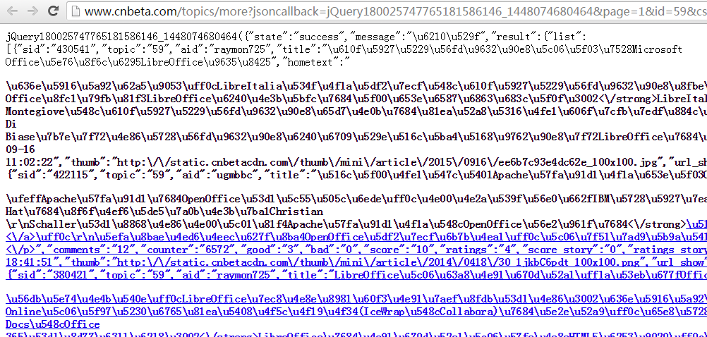

目标网站:http://www.cnbeta.com/
 
结果:首页最新消息的各个字段

<h1>一，分析:</h1>
在分析之前，首先下拉才会产生新的页面：调用的ajax的接口为：

http://www.cnbeta.com/more?jsoncallback=jQuery180044874770450405777_1448195804536&type=all&page=2&csrf_token=408cb414554a80658710393c3c32d1b23dfef562&_=1448195823137
 
type:类型
 
page:第几页
 
csrf_token:token 参考
_ = 时间参数，由当前时间生成

其中cstf_token 与_  参数生成值是具有一定的时间限制的和匹配性，任何一个参数不对直接导致调用失败.

<h1>二，实施方案:</h1>

根据以往经验一般网站的抓抓取难易度都按以下排名：

手机版->桌面版->

手机版网页如下：
http://m.cnbeta.com/view_449839.htm

手机版可以轻松的抓到分页数据，不用考虑js的方面，但是有另外一个问题，无法正常的抓到所有的字段，比如打分，评价等字段

在另外转换思维：
使用JS模拟器,js模拟器可以拿到结果，使用selenium完全可以拿到ajax的内容，但是考虑到文件的渲染内容后，这不是很有效率的一种方法与方式

<h1>三，更进一步分析:</h1>
当我打开某个暗送具体的目录的时候，比如：http://www.cnbeta.com/topics/9.htm

里面的所用的jquery call:地址为http://www.cnbeta.com/topics/more?jsoncallback=jQuery18005219338091555983_1448211396216&page=2&id=9&csrf_token=2d76f7089e98872e8addd6ddf08f545ba995e398&_=1448211433100

这里面的http://www.cnbeta.com/topics/9.htm 与query参数中的id=9是一致的，换另外一句话说：
如果我先抓取了所有的目录列表，并发的访问就可以获得想要的数据了。
 </img>

<h1>四，结果:</h1>
cnbeta为实使化目录的文件夹
 
main文件夹是单独的一个py文件

